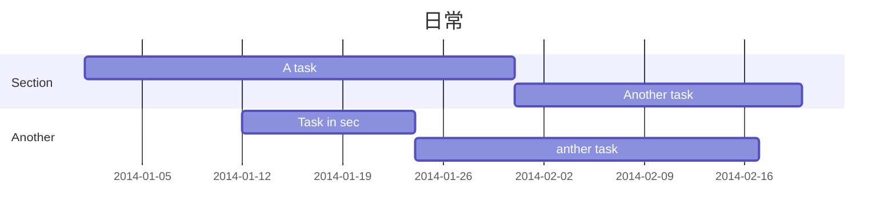
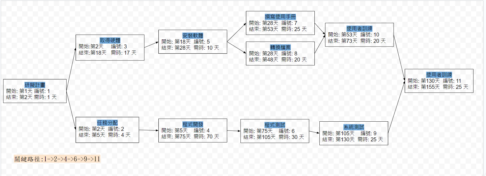

# 專案管理

## 甘特圖

```mermaid
gantt
    title 日常

    section Section
    A task           :a1, 2014-01-01, 30d
    Another task     :after a1  , 20d
    section Another
    Task in sec      :2014-01-12  , 12d
    anther task      : 24d
```
## PERT/CPM 
## 關鍵路徑

